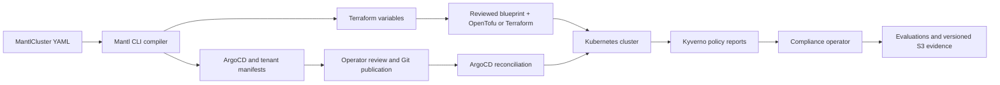

<!-- SPDX-License-Identifier: Apache-2.0 -->


# Mantl

Repeatable Kubernetes platform configuration with traceable compliance evidence.

[](https://github.com/somethingwithproof/mantl/actions/workflows/ci.yml)
[](https://sonarcloud.io/summary/new_code?id=somethingwithproof_mantl)
[](https://github.com/somethingwithproof/mantl/releases/latest)
[](LICENSE)
[](https://scorecard.dev/viewer/?uri=github.com/somethingwithproof/mantl)
[](mise.toml)
[](docs/README.md)

Platform teams manually integrate infrastructure provisioning, GitOps delivery,
tenant isolation, security policies, and audit evidence. Keeping these pieces
consistent—and explaining which controls are covered—requires ongoing engineering.

Mantl reduces that assembly work with a **platform compiler**: a `MantlCluster`
YAML file becomes Terraform variable inputs, ArgoCD Application manifests, and
namespace isolation manifests. A separate Go compliance operator reconciles
control mappings, findings, evaluations, and retained evidence. The goal is a
repeatable platform whose configuration and audit evidence can be inspected.
The runtime is **beta**; start with offline generation below.

## Who it is for

Mantl is for platform engineers who own Kubernetes infrastructure and GitOps, and
security engineers who need to inspect the evidence behind configured controls.
Use it to:

- Generate a consistent platform topology and tenant namespace baseline for review.
- Track policy findings alongside control coverage, evidence freshness, and exceptions.
- Collect versioned evidence and export archives whose contents can be verified.

You provide the specification, Git repository and revision, reviewed infrastructure
settings, cloud identity, Kubernetes access, policy scope, and evidence bucket.
You remain responsible for cloud accounts and costs, Terraform state, Git access,
network connectivity, tenant access review, workload backups, upgrades, control
completeness, and recovery testing. Mantl does not replace those decisions or an auditor.

## How it works



`plan` runs offline and writes configuration. Its Terraform output is a variables
file, **not a complete infrastructure configuration or a Terraform resource-change
plan**. OpenTofu/Terraform combines it with an existing provider blueprint to
provision resources. The separate `apply` command invokes provisioning and cluster
bootstrap; it changes infrastructure and can incur costs.

ArgoCD reconciles repository content into the cluster. Kyverno enforces configured
admission policies and produces PolicyReports. The compliance operator interprets
configured mappings and collects evidence; it does not apply policy changes.

## A small example

Save this as `platform.yaml`. It models a development EKS platform with one tenant;
the domain and admin identity are examples, and the Kubernetes version is an
input for generation, not a recommendation of current cloud availability.

```yaml
apiVersion: platform.mantl.io/v1alpha1
kind: MantlCluster
metadata:
  name: team-dev
spec:
  provider:
    kind: aws
    region: us-east-1
  kubernetes:
    distribution: eks
    version: "1.31"
  profile:
    size: small
  networking:
    domain: platform.example.com
    exposure: private
  features:
    security: true
  gitops:
    repository: https://github.com/somethingwithproof/mantl.git
    revision: v0.5.0
    tenantPath: tenants/team-dev
  tenants:
    - name: payments
      admins: [payments-admin@example.com]
```

With v0.5.0, `mantl plan platform.yaml` generates six files:

```text
.mantl/build/
├── terraform.tfvars.json
├── gitops/
│   ├── root-platform.yaml
│   ├── addon-security.yaml
│   └── platform-tenants.yaml
└── tenants/
    ├── kustomization.yaml
    └── payments.yaml
```

The variables contain `cluster_name`, `region`, `kubernetes_version`, and
`environment` (`dev`). Profile size sets labels, not cloud node sizes; networking
fields do not automatically configure private access or DNS. The Applications reference `deploy/gitops/core`,
`platform/security/base`, and `tenants/team-dev` at the specified Git revision.
The tenant file contains a Namespace, an admin RoleBinding, a default-deny
NetworkPolicy, a ResourceQuota, and a LimitRange.

This example is ready for **offline generation**. Before deployment, use a repository
and revision you control containing the platform paths and committed tenant files;
`tenants/team-dev` is not supplied by the referenced Mantl release. Review identities,
resource limits, and DNS/service traffic rules. Network isolation requires a CNI
that enforces NetworkPolicy. See [specification and outputs](docs/platform-planning.md).

## Getting started

This guide targets [v0.5.0](https://github.com/somethingwithproof/mantl/releases/tag/v0.5.0).
Downloadable CLI archives cover Linux/macOS on amd64/arm64; Linux also has DEB/RPM
packages. Go, cloud credentials, Terraform, and a cluster are unnecessary for `plan`.

1. Follow the [verified release installation](docs/quickstart-platform.md#install-a-verified-release).
   Authenticate the checksum manifest with Cosign before checking artifact hashes.
2. Save the specification above as `platform.yaml` in a new working directory.
3. Using the installed CLI, generate and inspect the files:

   ```sh
   mantl --version
   mantl plan platform.yaml
   cat .mantl/build/terraform.tfvars.json
   cat .mantl/build/tenants/payments.yaml
   ```

The result is local configuration to review. Nothing has been provisioned or applied.
Continue with [bootstrap prerequisites](docs/quickstart-platform.md#deployment-is-a-separate-step)
only when you have supplied environment-specific settings and understand the changes.

**Review before deployment:** v0.5.0 also supports offline plan previews,
saved inventories and comparisons, and `apply --plan` verification with preflight
and expected-Application convergence. These flags are absent from v0.4.0.
Follow the [planning guide](docs/platform-planning.md#preview-and-inventory)
to review the generated inputs before applying them.

## Capabilities and maturity

| Area | What exists | Maturity / validation boundary |
| --- | --- | --- |
| Configuration compiler | Strict spec parsing; Terraform variables; feature Applications; tenant RBAC, quotas, limits, isolation; previews, saved inventories and comparisons | Available in v0.5.0; offline generation tested. Compiler inventories describe generated configuration, not infrastructure resource changes. |
| Bootstrap and observation | OpenTofu/Terraform invocation, kind path, pinned ArgoCD installation; reviewed-input verification; scoped `status` JSON and application gate | Beta. Local tests cover preflight and scoped convergence. Application health is distinct from compliance; bootstrap success is not cloud acceptance. |
| AWS EKS, GCP GKE, Azure AKS | Blueprints and a common static hardening contract | Static validation exists; deployment, identity, upgrade, audit delivery, and recovery acceptance remain unestablished. |
| Other providers | DOKS, LKE, OKE, IKS, and OpenStack assets/parser options | Experimental; assets do not establish a working deployment path. |
| Compliance runtime | Profiles, PolicyReport findings, scheduled AuditRuns/collector Jobs, evaluations, exception approval, history | Beta. Resource snapshots are implemented; unsupported log/metrics/query collectors remain coverage gaps. |
| Framework content | SOC2, HIPAA, PCI-DSS, CIS Kubernetes catalogs/profiles; reviewed SOC2 policy topology; [DISA Kubernetes STIG V2R3](docs/stig-kubernetes.md) catalog and opt-in workload audit policies | STIG integration is experimental, with explicit manual coverage gaps. Content and mappings are not proof of complete or end-to-end framework coverage. Evidence supports audits, not certification. |
| Evidence | AWS S3 versioned objects, Object Lock COMPLIANCE retention, hash/version verification, archive export | AWS S3 backend for all cluster providers; native GCS/Azure WORM backends are not implemented. |
| Fleet and exchange | Optional mTLS fleet metadata service, PostgreSQL tenant isolation/replay; bounded OSCAL catalog exchange | Beta; requires operator overlays. No fleet UI; OSCAL exchange covers IDs/titles, not complete assessment interchange. |
| Release distribution | Signed checksums, CLI archives/DEB/RPM, pinned install manifests, control/platform bundles, SBOMs and provenance | Published assets; package validation does not establish cloud deployment or version-to-version upgrade acceptance. |

Evaluations keep coverage, result, freshness, evidence, and exceptions separate.
Missing or stale evidence cannot establish a current pass. An approved exception
annotates a failure without turning it into a pass. A configured control mapping
shows intended scope, not proof that every workload is covered.

Vendored charts under `platform/` and architecture plans describe a larger possible
stack; their presence does not establish integrated support. See the
[architecture boundaries](docs/architecture-diagram.md) and
[provider acceptance limits](docs/architecture-runtime.md#provider-acceptance-and-oscal).

## Architecture and responsibilities

- **CLI and packages** (`cmd/mantl`, `pkg/compiler`, `pkg/bootstrap`): validate inputs,
  render configuration, and explicitly invoke provisioning/bootstrap tools.
- **ArgoCD and Kyverno** (`deploy/gitops`, `policies/kyverno`): Git owns desired policy
  content; ArgoCD reconciles it, and Kyverno supplies enforcement/reporting.
- **Compliance APIs and controllers** (`apis/compliance`, `controllers/compliance`):
  reconcile profiles, findings, audit schedules/runs, evaluations, and exceptions.
- **Collectors and evidence** (`pkg/collection`, `pkg/evidence`): bounded collection,
  retained raw objects in S3, and version/hash references in Kubernetes metadata.
- **Framework data** (`compliance/frameworks`): YAML catalogs, profiles, and mappings
  reviewed independently of the Go runtime.
- **Optional fleet** (`pkg/fleet`, `deploy/fleet`): authenticated metadata aggregation;
  PostgreSQL is a rebuildable index, and raw evidence remains in object storage.

The [runtime architecture](docs/architecture-runtime.md) details identities, storage,
policy ownership, and failure handling.

## Documentation

Start at the [documentation index](docs/README.md), or go directly to:

- [Quickstart and bootstrap](docs/quickstart-platform.md)
- [Platform specification, examples, and generated outputs](docs/platform-planning.md)
- [Observed platform status](docs/platform-status.md)
- [Compliance concepts, storage, verification, and export](docs/compliance-operations.md)
- [Architecture diagrams](docs/architecture-diagram.md) and [runtime responsibilities](docs/architecture-runtime.md)
- [Operations, upgrades, backup, and recovery](docs/runbooks.md)
- [Releases and verification](docs/releases.md)
- [Troubleshooting](docs/troubleshooting.md)

## Development and contributing

Use the pinned [mise toolchain](mise.toml). Read [CONTRIBUTING.md](CONTRIBUTING.md)
for setup, scoped tests, dependency locks, devcontainers, and pull requests, and
[AGENTS.md](AGENTS.md) for repository boundaries. Design records live in
[docs/adr](docs/adr); roadmaps under [docs/superpowers/specs](docs/superpowers/specs)
are intentions, not release guarantees.

## Security and license

Report vulnerabilities privately through [GitHub Security Advisories](https://github.com/somethingwithproof/mantl/security/advisories/new).
See the [security policy](SECURITY.md). Mantl is licensed under [Apache-2.0](LICENSE);
the existing MIT components and vendored content retain their own licenses.
See [license declarations and maintenance](docs/licensing.md) for component scope
and SPDX conventions.
