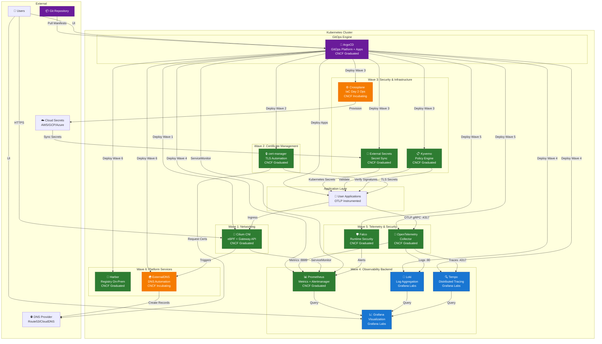
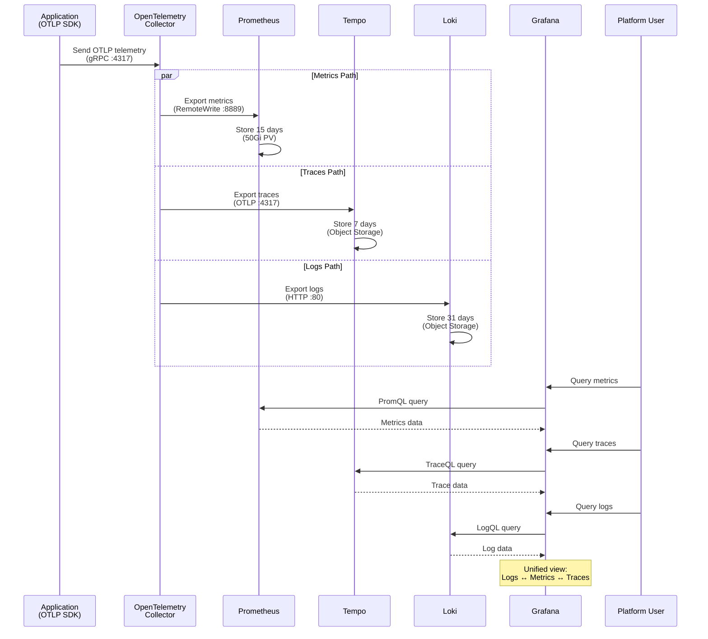
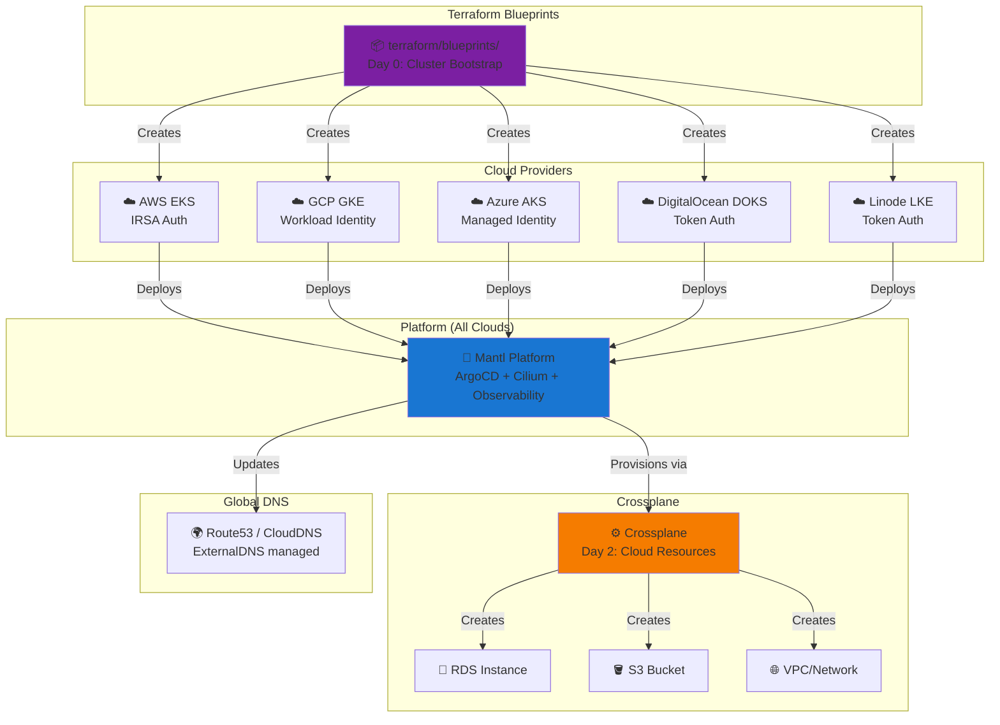

# Mantl Platform Architecture

## Complete Platform Stack

## Data Flow: Observability Stack

## CI/CD Workflow

```mermaid
flowchart LR
    subgraph "CI (GitHub Actions)"
        Code[💻 Code Push]
        Lint[✅ Lint<br/>black, ruff, yamllint]
        Test[🧪 Test<br/>pytest]
        Build[🏗️ Build Image]
        Scan[🔍 Scan<br/>Trivy]
        SBOM[📋 SBOM<br/>Syft]
        Sign[✍️ Sign<br/>Cosign OIDC]
        Push[📤 Push Image<br/>GHCR/ECR/GCR]
    end

    subgraph "CD (ArgoCD)"
        PR[📝 Create PR<br/>Update image tag]
        Review[👀 Review + Approve]
        Merge[🔀 Merge to main]
        Sync[🔄 ArgoCD Sync]
        Verify[✅ Kyverno Verify<br/>Image Signature]
        Deploy[🚀 Deploy to K8s]
    end

    Code --> Lint
    Lint --> Test
    Test --> Build
    Build --> Scan
    Scan --> SBOM
    SBOM --> Sign
    Sign --> Push
    Push --> PR
    PR --> Review
    Review --> Merge
    Merge --> Sync
    Sync --> Verify
    Verify --> Deploy

    style Code fill:#4CAF50
    style Deploy fill:#2196F3
    style Sign fill:#FF9800
    style Verify fill:#FF9800
```

## Multi-Cloud Architecture

## Legend

- 🟢 **CNCF Graduated** (9 projects): Kubernetes, Cilium, ArgoCD, cert-manager, Kyverno, External Secrets, Prometheus, OpenTelemetry, Falco, Harbor
- 🟠 **CNCF Incubating** (2 projects): Crossplane, ExternalDNS
- 🔵 **Non-CNCF** (3 projects): Grafana, Loki, Tempo

## Architecture Principles

1. **GitOps-First**: All configuration in Git, deployed via ArgoCD
2. **CNCF-Native**: Prefer graduated/incubating projects for stability
3. **Multi-Cloud**: Consistent platform across AWS, GCP, Azure, DO, Linode
4. **Security by Default**: Policy enforcement, image signing, runtime security
5. **Observable**: Full telemetry correlation (logs ↔ metrics ↔ traces)
6. **Declarative**: Kubernetes APIs for apps and infrastructure (Crossplane)
