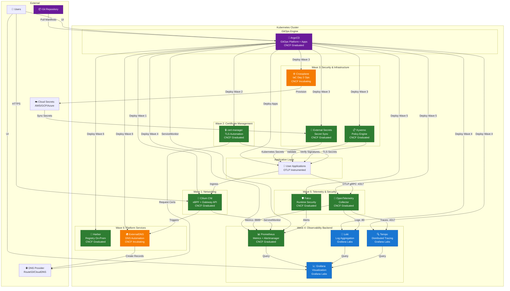
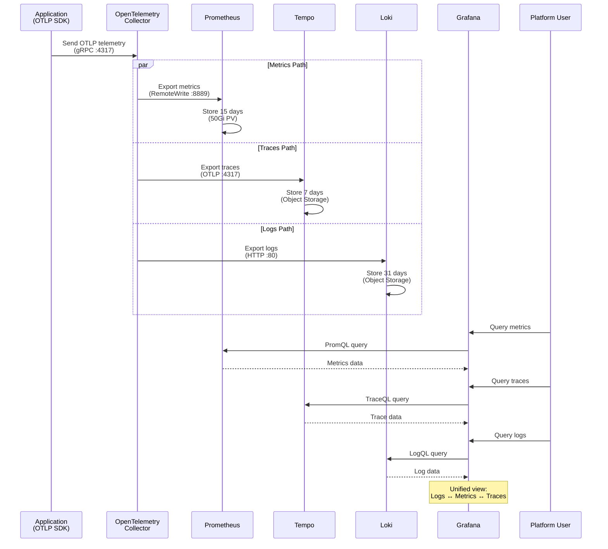
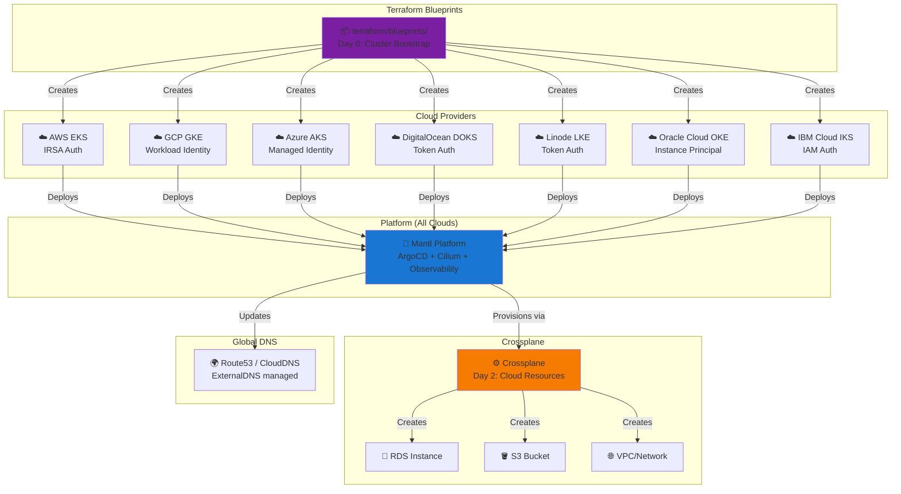

# Mantl Platform Architecture

**Last Updated**: 2025-12-27

## Overview

This document provides a comprehensive view of the Mantl platform architecture, including component relationships, data flows, deployment patterns, and multi-cloud support.

**Target Audience**: Platform engineers, DevOps teams, and solution architects evaluating or operating Mantl.

## Table of Contents

- [Platform Stack Overview](#platform-stack-overview)
- [Observability Data Flow](#observability-data-flow)
- [CI/CD Pipeline](#cicd-pipeline)
- [Multi-Cloud Architecture](#multi-cloud-architecture)
- [Architecture Principles](#architecture-principles)
- [Component Matrix](#component-matrix)
- [Related Documentation](#related-documentation)

## Platform Stack Overview

The Mantl platform consists of multiple layers deployed in dependency order using ArgoCD sync waves. This ensures components are available before dependent services attempt to use them.

### Deployment Waves

The platform deploys components in six waves:

1. **Wave 1: Networking** - CNI and Gateway API foundation
2. **Wave 2: Certificate Management** - TLS automation
3. **Wave 3: Security & Infrastructure** - Secrets, policies, and cloud resource management
4. **Wave 4: Observability Backend** - Metrics, logs, and traces storage
5. **Wave 5: Telemetry & Security** - Data collection and runtime security
6. **Wave 6: Platform Services** - Registry and DNS automation

### Architecture Diagram

### Key Integration Points

- **GitOps**: ArgoCD continuously reconciles cluster state with Git repository
- **Secrets Management**: External Secrets Operator syncs secrets from cloud providers
- **Policy Enforcement**: Kyverno validates resources and verifies image signatures
- **DNS Automation**: ExternalDNS creates DNS records from Kubernetes Ingress/Services
- **TLS Automation**: cert-manager provisions and renews certificates automatically
- **Observability**: OpenTelemetry Collector routes telemetry to appropriate backends

## Observability Data Flow

The observability stack provides unified visibility across metrics, logs, and traces using the OpenTelemetry standard.

### Telemetry Architecture

Applications instrument with OpenTelemetry SDKs and send all telemetry to the OpenTelemetry Collector via gRPC. The Collector then routes data to specialized backends:

- **Metrics** → Prometheus (15-day retention, 50Gi storage)
- **Traces** → Tempo (7-day retention, object storage)
- **Logs** → Loki (31-day retention, object storage)

Grafana provides a unified query interface with correlation between all three signal types.

### Sequence Diagram

### Benefits

- **Single Protocol**: Applications only need to implement OTLP
- **Correlation**: Navigate from logs → traces → metrics seamlessly
- **Vendor Neutral**: OpenTelemetry is a CNCF standard
- **Cost Optimized**: Different retention policies per signal type

## CI/CD Pipeline

Mantl implements a secure CI/CD pipeline with automated security scanning, signing, and GitOps-based deployment.

### Pipeline Stages

**Continuous Integration (GitHub Actions):**

1. **Lint** - Code quality checks (Black, Ruff, yamllint)
2. **Test** - Unit and integration tests (pytest)
3. **Build** - Container image creation
4. **Scan** - Security vulnerability scanning (Trivy)
5. **SBOM** - Software Bill of Materials generation (Syft)
6. **Sign** - Cryptographic signing with Cosign (OIDC keyless)
7. **Push** - Publish to container registry (GHCR, ECR, GCR)

**Continuous Deployment (ArgoCD):**

1. **PR Creation** - Automated or manual image tag update
2. **Review** - Human approval for production changes
3. **Merge** - Commit to main branch
4. **Sync** - ArgoCD detects changes and synchronizes
5. **Verify** - Kyverno validates image signatures
6. **Deploy** - Rollout to Kubernetes cluster

### Workflow Diagram

### Security Features

- **Signed Artifacts**: All images signed with Cosign (OIDC keyless signing)
- **Verification**: Kyverno policies enforce signature verification before deployment
- **SBOM**: Software Bill of Materials generated for supply chain transparency
- **Vulnerability Scanning**: Trivy scans for CVEs before images are published

```mermaid
flowchart LR
    subgraph "CI (GitHub Actions)"
        Code[💻 Code Push]
        Lint[✅ Lint<br/>black, ruff, yamllint]
        Test[🧪 Test<br/>pytest]
        Build[🏗️ Build Image]
        Scan[🔍 Scan<br/>Trivy]
        SBOM[📋 SBOM<br/>Syft]
        Sign[✍️ Sign<br/>Cosign OIDC]
        Push[📤 Push Image<br/>GHCR/ECR/GCR]
    end

    subgraph "CD (ArgoCD)"
        PR[📝 Create PR<br/>Update image tag]
        Review[👀 Review + Approve]
        Merge[🔀 Merge to main]
        Sync[🔄 ArgoCD Sync]
        Verify[✅ Kyverno Verify<br/>Image Signature]
        Deploy[🚀 Deploy to K8s]
    end

    Code --> Lint
    Lint --> Test
    Test --> Build
    Build --> Scan
    Scan --> SBOM
    SBOM --> Sign
    Sign --> Push
    Push --> PR
    PR --> Review
    Review --> Merge
    Merge --> Sync
    Sync --> Verify
    Verify --> Deploy

    style Code fill:#4CAF50
    style Deploy fill:#2196F3
    style Sign fill:#FF9800
    style Verify fill:#FF9800
```

## Multi-Cloud Architecture

Mantl provides consistent platform capabilities across seven cloud providers using a two-phase provisioning model.

### Supported Providers

| Provider | Kubernetes Service | Authentication Method | Status |
|----------|-------------------|----------------------|---------|
| AWS | Elastic Kubernetes Service (EKS) | IRSA (IAM Roles for Service Accounts) | ✅ Production |
| Google Cloud | Google Kubernetes Engine (GKE) | Workload Identity | ✅ Production |
| Azure | Azure Kubernetes Service (AKS) | Managed Identity | ✅ Production |
| DigitalOcean | DigitalOcean Kubernetes (DOKS) | Token Authentication | ✅ Production |
| Linode | Linode Kubernetes Engine (LKE) | Token Authentication | ✅ Production |
| Oracle Cloud | Oracle Kubernetes Engine (OKE) | Instance Principal | ✅ Production |
| IBM Cloud | IBM Kubernetes Service (IKS) | IAM Authentication | ✅ Production |

### Two-Phase Provisioning

**Phase 1: Cluster Bootstrap (Day 0)**
- Terraform/OpenTofu blueprints provision managed Kubernetes clusters
- Located in `terraform/blueprints/<provider>`
- Handles VPC, networking, IAM, and cluster creation

**Phase 2: Cloud Resources (Day 2)**
- Crossplane provisions cloud resources from Kubernetes
- Databases, storage buckets, VPCs created as Kubernetes custom resources
- Enables GitOps for infrastructure management

### Architecture Diagram

### Multi-Cloud Benefits

- **Provider Flexibility**: Switch providers without application changes
- **Disaster Recovery**: Deploy across multiple clouds for resilience
- **Cost Optimization**: Use different providers for different workloads
- **Vendor Independence**: Avoid lock-in with portable platform

## Architecture Principles

Mantl follows six core architectural principles:

### 1. GitOps-First

**All configuration lives in Git and is deployed via ArgoCD.**

- Infrastructure as Code (Terraform blueprints)
- Platform configuration (Kustomize overlays)
- Application manifests (Helm charts or plain YAML)
- Policy definitions (Kyverno policies)

### 2. CNCF-Native

**Prefer Cloud Native Computing Foundation graduated or incubating projects.**

This ensures:
- Production-grade stability
- Active community support
- Vendor neutrality
- Interoperability

### 3. Multi-Cloud Ready

**Provide consistent platform capabilities across all major cloud providers.**

- Unified abstractions (External Secrets, ExternalDNS)
- Provider-specific authentication (IRSA, Workload Identity, etc.)
- Portable workloads

### 4. Security by Default

**Security is built-in, not bolted on.**

- Policy enforcement (Kyverno)
- Image signature verification (Cosign)
- Runtime threat detection (Falco)
- Secret management (External Secrets)
- Network policies (Cilium)

### 5. Observable

**Full correlation between logs, metrics, and traces.**

- Single collection protocol (OTLP)
- Unified visualization (Grafana)
- Distributed tracing enabled
- Golden signals monitored

### 6. Declarative

**All resources managed through Kubernetes APIs.**

- Applications (Deployment, StatefulSet)
- Infrastructure (Crossplane)
- Policies (Kyverno)
- Monitoring (ServiceMonitor)

## Component Matrix

### CNCF Project Status

| Component | CNCF Status | Category | Purpose |
|-----------|-------------|----------|---------|
| **ArgoCD** | Graduated | GitOps | Continuous deployment |
| **Cilium** | Graduated | Networking | CNI, service mesh, Gateway API |
| **cert-manager** | Graduated | Security | TLS certificate automation |
| **External Secrets** | Graduated | Security | Cloud secrets synchronization |
| **Kyverno** | Graduated | Security | Policy enforcement |
| **Prometheus** | Graduated | Observability | Metrics collection |
| **OpenTelemetry** | Graduated | Observability | Telemetry collection |
| **Falco** | Graduated | Security | Runtime threat detection |
| **Harbor** | Graduated | Platform | Container registry |
| **Crossplane** | Incubating | Infrastructure | Cloud resource management |
| **ExternalDNS** | Incubating | Networking | DNS record automation |

### Non-CNCF Components

| Component | Vendor | Purpose |
|-----------|--------|---------|
| **Grafana** | Grafana Labs | Visualization and dashboards |
| **Loki** | Grafana Labs | Log aggregation |
| **Tempo** | Tempo Labs | Distributed tracing |

**Rationale**: These are industry-standard observability tools with excellent integration.

## Related Documentation

- **[Quick Start Guide](quickstart-platform.md)** - Deploy the platform in minutes
- **[Development Guide](../DEVELOPMENT.md)** - Contributing and local development
- **[Security Guide](security.md)** - Security features and configuration
- **[Architecture Decision Records](ara/README.md)** - Design decisions and rationale
- **[Compliance Module](../compliance/README.md)** - Compliance-as-Code documentation

## Next Steps

1. **Deploy**: Follow the [Quick Start Guide](quickstart-platform.md)
2. **Customize**: Review [Architecture Decision Records](ara/README.md) for design choices
3. **Secure**: Configure [security features](security.md)
4. **Contribute**: See [CONTRIBUTING.md](../CONTRIBUTING.md)

---

**Questions?** Open an issue on [GitHub](https://github.com/thomasvincent/mantl/issues).
