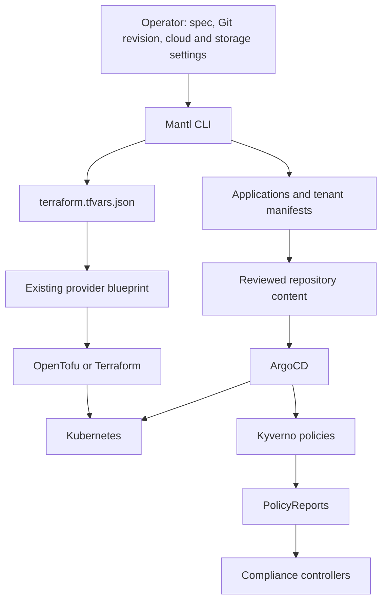
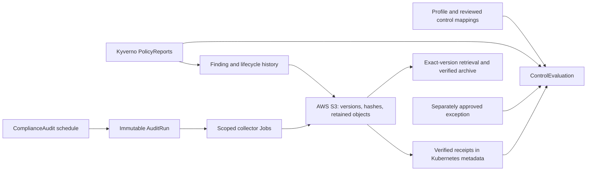

<!-- SPDX-License-Identifier: Apache-2.0 -->
# Architecture and responsibility boundaries

These diagrams show implemented ownership boundaries in the beta runtime.
For capability maturity use [the project table](../README.md#capabilities-and-maturity).
For deployment requirements use [the quickstart](quickstart-platform.md#deployment-is-a-separate-step).

## Configuration flow

The compiler generates inputs and references. Publishing tenant files to Git,
selecting valid infrastructure settings, supplying credentials, and configuring
state are operator work. Explicit `apply` invokes provisioning and bootstrap;
`plan` does not. ArgoCD owns desired policies; the compliance operator observes
reports and evidence, without directly applying policies.

`MantlCluster` is the CLI input type, not an implemented cluster provisioning
reconciler. Compliance APIs have generated CRDs and controllers. Framework YAML
is content, and vendored `platform/` charts are upstream assets.

## Evidence lifecycle

Kubernetes holds status, scope, references, and history heads; raw evidence lives
in S3. Object version IDs and hashes identify what was captured. Jobs cannot
choose an arbitrary collector image or storage identity. Approved exceptions
annotate results; they do not erase failures. Missing reports, mappings, timestamps,
or collector output remain visible as unknown/partial or stale state.

Only allowlisted Kubernetes resource snapshots are executed by the collectors.
Framework references to unsupported log/metric/query collection are gaps. Falco
JSON can be converted to a Finding manifest through a trusted ingestion path;
there is no automatically integrated public event receiver.

## Optional fleet and boundaries

The optional fleet service accepts enrolled mutual-TLS identities, verifies S3
journal references, and stores metadata in PostgreSQL with tenant row-level
security. PostgreSQL is a rebuildable index; it is not the raw evidence store.
No fleet UI or cluster-admin proxy is implemented.

AWS/GCP/Azure blueprints have static contract tests. They do not establish working
cloud deployments, recovery, or storage parity. The evidence implementation uses
AWS S3 even when Kubernetes runs on another provider. Crossplane/cloud failover
and the larger observability stack in older ARA diagrams are design/reference
material, not guaranteed by this implementation.

See [runtime architecture](architecture-runtime.md), [compliance operations](compliance-operations.md),
[policy ownership ADR](adr/006-policy-application-ownership.md), and
[storage ADR](adr/003-evidence-storage-contract.md).
