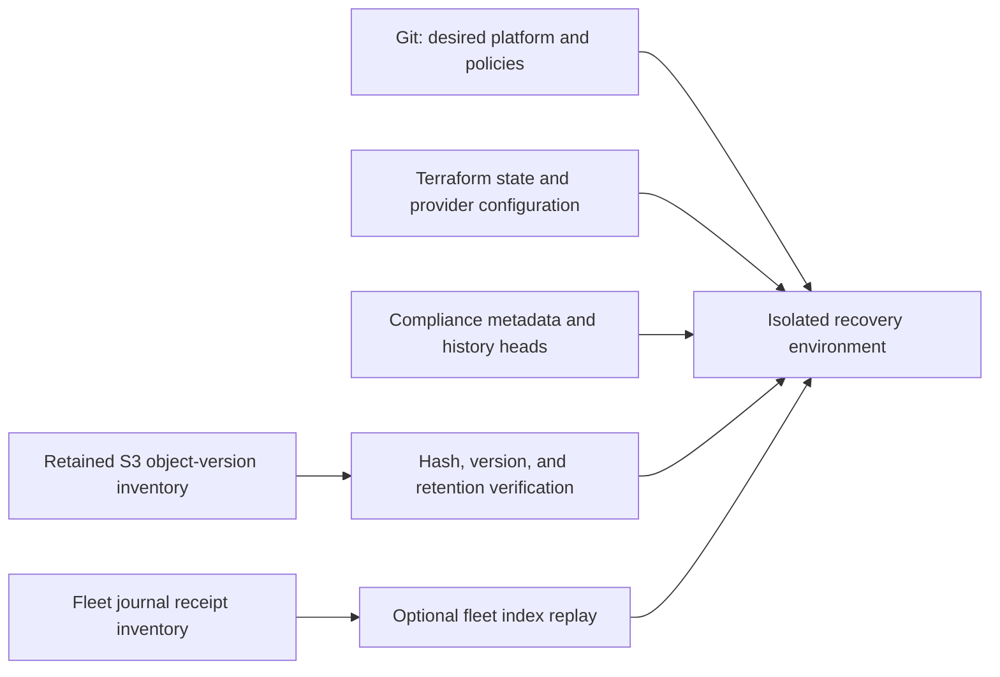

# Operations, upgrades, backup, and recovery

These procedures cover implemented Mantl responsibilities. They require adaptation
and rehearsal in your environment; no cloud recovery time, recovery point, or
successful cloud upgrade is claimed. [Compliance operations](compliance-operations.md)
contains storage permissions, retention, collection, and export details.

## Observe independently

Use the same reviewed specification used for generation, plus an authenticated
context. These commands read a live cluster; they are not part of the offline quickstart.

```sh
mantl --context TARGET status platform.yaml --format json --require-healthy
mantl --context TARGET compliance status --namespace mantl-compliance-system
```

Application health and compliance are separate. Inspect expected source identities,
control coverage, freshness, failed collectors, exceptions, and pending finding
history. Install `deploy/operator/monitoring` only with Prometheus Operator CRDs
and a matching ServiceMonitor selector; tune evidence-age thresholds to schedules.

## Upgrade preparation

Record the installed CLI version, image digest, control bundle digest, Git revision,
CRD schemas, evidence bucket/configuration, identities, and active run scopes.
Verify the candidate release using [the release guide](releases.md) and review its
changelog and schema diff. Rehearse in an isolated environment before deployment.

Back up compliance metadata and history heads, Terraform state, Git configuration,
and application data using your established platform backup process. Maintain an
inventory of exact S3 object versions and fleet journal receipts. Mantl does not
install or validate a backup system for you.

Finish or explicitly retire active AuditRuns before changing storage or collector
identities; migration during an active run is unsupported. Apply reviewed,
digest-pinned manifest/overlay changes through the chosen GitOps workflow. Upgrade
CRDs deliberately before relying on new fields. Schema removal and downgrades are
not automatically safe; restoring old manifests is not a universal rollback.

For Kubernetes/infrastructure upgrades, use the selected provider's procedures,
review the actual OpenTofu/Terraform resource plan, and preserve its state/backend.
`mantl plan` is not that plan, and `mantl apply` invokes infrastructure apply rather
than enforcing a saved resource-plan approval. Do not edit variable declarations
as a substitute for versioned environment inputs.

## Backup boundaries



Raw evidence is retained in S3 rather than etcd. Kubernetes metadata backups alone
cannot reconstruct every object reference or finding history head if those fields
were omitted. Retention survives metadata deletion and uninstall; do not shorten
Object Lock retention during upgrades or recovery.

## Recovery checks

1. Recreate the required cluster access, trusted control namespace, Kyverno report
   CRDs, reviewed policy content, operator settings, and scoped workload identities.
2. Restore profile/audit/run/finding/evaluation/exception metadata and history
   heads into an isolated environment. Confirm schema compatibility before writes.
3. Verify retained object versions, hashes, encryption, retention, and identity
   access. Use `mantl compliance export RUN --run --output evidence.tar.gz` with
   the target context to test historical retrieval; preserve failure evidence.
4. Observe retryable runs and pending history transitions after storage access is
   restored. Failed/partial collection remains visible; do not declare success
   solely because pods run or application health is green.
5. For fleet recovery, rebuild PostgreSQL through verified journal receipts and
   `mantl fleet replay`; follow [fleet setup](architecture-runtime.md#optional-fleet-metadata-service).
   Restore enrollment/TLS and network scope independently of the index.
6. Confirm expected scope and freshness before resuming schedules. Record your
   results, limitations, and environment-specific recovery objectives.

These are validation steps for operators to perform, not previously measured recovery
results. See [troubleshooting](troubleshooting.md) for retry/unknown states.

## Historical component procedures

The detailed [upgrade](runbooks/upgrade-procedures.md),
[disaster recovery](runbooks/disaster-recovery.md),
[scaling](runbooks/scaling-operations.md),
[incident response](runbooks/incident-response.md), and
[component troubleshooting](runbooks/troubleshooting-guide.md) runbooks contain
older example-stack procedures. Review commands and your installed components
before use; they do not establish an integrated Velero deployment, automatic cloud
failover, recovery-time guarantees, or acceptance of the current runtime.
