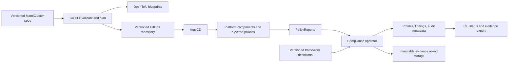

# Mantl features and architecture plan

Date: 2026-10-04
Status: implementation delivered; local validation continues; production acceptance pending
Baseline: `d83e2d28265ccdd0dd9e289f9867d326fd9de32b` on `somethingwithproof/mantl` main

## Implementation checkpoint (2026-10-06)

The inventory and ordered work below preserve the original planning baseline;
they are not a current list of missing features. Subsequent authorization included
the release phase and the 2026–2027 architecture in ADR 008.

| Phase | Delivered implementation and local verification | Remaining acceptance |
| --- | --- | --- |
| 1: Installation | Strict compiler contracts, packaged frameworks, CRDs/RBAC and an injected evidence reader; compiler, framework and disposable API fixtures | Environment-specific installation, identity and upgrade evidence |
| 2: Compliance/evidence | Immutable AuditRuns, isolated collectors, evaluations, retained evidence receipts, finding history and export verification; controller and storage failure-path tests | End-to-end enforcement, retained storage, recovery and operational acceptance in target clusters |
| 3: Release | [v0.3.1](https://github.com/somethingwithproof/mantl/releases/tag/v0.3.1) published CLI archives, DEB/RPM, manifests, OCI assets, checksums, SBOMs and provenance; signatures and all CLI provenance verified independently | Native package lifecycle checks now exercise installation, reinstallation and removal; version-to-version upgrade acceptance remains separate |
| 4: Operations | AWS/GCP/Azure static contracts, observability and recovery runbooks; no cloud parity inferred from static checks | Recorded deployment, audit delivery, private administration, upgrade and recovery evidence per provider |
| 5: Features | Machine-readable compliance/evidence commands, reviewed GitOps remediation suggestions, Falco ingestion, tenant-isolated fleet metadata and Backstage PR scaffolding | Fleet deployment, native non-S3 WORM storage, and separate framework/control acceptance; no portal or fleet UI claimed |

Use [compliance operations](../../compliance-operations.md),
[runtime architecture](../../architecture-runtime.md) and
[release verification](../../releases.md) for current behavior and commands.
The runtime and fleet adapters remain beta. Local tests and package execution do
not establish cloud deployment safety, certification or an independently assessed
SLSA level. The remaining SPIRE privileges and undeployed Nomad archive limits
are conditional exceptions governed by
[ADR 010](../../adr/010-security-exception-boundaries.md).

## Product direction

Make Mantl an adoptable Kubernetes platform with a verifiable compliance workflow.
The first supported journey should be: install a pinned platform, select the SOC2
profile, observe a policy violation, repair it through GitOps, and retrieve
hashed evidence from immutable storage. Policy coverage is not certification.

Keep the June modernization roadmap, but update its implementation inventory:
public-runner CI, policy resolution, recurring daily/weekly audits, and the live
status command already exist. Completing these again would waste effort.

## Verified feature inventory

| Area | Current implementation | Remaining gap |
| --- | --- | --- |
| Declarative platform | Go CLI parses a spec and renders Terraform variables, ArgoCD Applications, and tenant manifests | Generated source paths, published tenant manifests, provider inputs, and installation need an integration contract |
| Bootstrap | Kind or Terraform/OpenTofu provisioning followed by ArgoCD installation and convergence polling | Repository-relative dependencies, floating ArgoCD install URL, retry/idempotency, explicit target context, and bounded execution |
| Profile coverage | Framework controls resolve to existing policy templates; unresolved templates are reported | Runtime framework layout differs from the loader; resolution does not demonstrate live enforcement |
| Findings | Namespaced Kyverno PolicyReport failures create Findings | Existing Findings are not updated or resolved; framework attribution is generic; cluster reports need support |
| Audits | Daily/weekly recurrence, capture helper, S3 upload, SHA256 hashing, partial-failure phases | Controller reads obsolete evidenceResources, not populated evidenceCollector mappings; framework cron schedules are unused |
| Evidence | Resource allowlist, required namespace, encrypted S3 upload | Upload URI is discarded, EvidenceURI is not populated, object versions/retention are not verified, raw allowed resources may contain inline sensitive values |
| Operator installation | Deployment and RBAC manifests exist | Image lacks framework data and kubectl required by capture; deployment lacks evidence configuration and RBAC for findings, audits, reports, evidence reads, and leader-election leases; base omits CRDs |
| Platform add-ons | Vendored manifests/charts and Backstage catalog/scaffolder assets exist | Presence of assets alone does not establish integration, compatibility, isolation, or operational readiness |
| Cloud infrastructure | AWS, GCP, and Azure blueprints contain substantial infrastructure code | June's “bare wrappers” assessment is outdated; shared inputs/outputs, workload identity, evidence storage, and real acceptance evidence still need verification |
| Delivery | Release Please and OCI bundle publishing workflows exist | Release workflow does not authenticate ORAS explicitly or attach downloadable assets; Go CLI/operator are not built there; event chaining needs validation |

Evidence comes from `cmd/mantl/cmd`, `pkg/compiler`, `pkg/bootstrap`,
`controllers/compliance`, `pkg/evidence`, `Dockerfile.compliance-operator`,
`deploy/operator/base`, `infra/terraform/blueprints`, and `.github/workflows`.
This is a source review, not evidence of a deployed production system.

## Target architecture

Preserve ADR 006: ArgoCD owns policy creation, updates, and deletion. The operator
resolves controls, observes enforcement, and reports findings. Future remediation
proposes Git changes. Preserve ADR 003: raw evidence stays outside etcd; CRDs hold
metadata and references. Keep pure compiler/scheduler/storage contracts in `pkg`
and Kubernetes reconciliation in `controllers`. No new microservices are needed.

## Ordered implementation

### 1. Establish one supported installation contract

- Choose the Go CLI as the supported entry point; explicitly document legacy
  shell CLI migration. Add strict spec validation, supported provider/distribution
  combinations, repository/revision settings, and target kube-context.
- Define where generated GitOps and tenant files are committed and how ArgoCD
  reads them. Validate feature paths before rendering; stop hardcoding main and
  the previous owner's repository URL.
- Package framework and policy data with the operator; use one canonical loader
  for `<framework>/framework.yaml` and validate requested framework versions.
- Complete operator CRD installation, generated/reviewed RBAC, evidence settings,
  and digest-pinned image references. Replace the kubectl evidence subprocess
  with an injected Kubernetes reader so the minimal image can collect evidence.
- Pin bootstrap dependencies, make repeated installation converge, propagate
  cancellation/timeouts, and share the stricter health evaluation used by status.

Acceptance: clean installation manifests render and validate; an isolated
integration fixture starts the operator with packaged data and required permissions;
repeat reconciliation succeeds without depending on the checkout working directory.

### 2. Complete the SOC2 compliance and evidence workflow

- Convert config-snapshot mappings into a validated collection plan. Resolve
  resource aliases and explicit scopes; reconcile current framework requests for
  clusterroles/clusterrolebindings with the namespaced-only allowlist.
- Report unsupported collector types/queries as coverage gaps; never silently
  treat them as successful evidence. Decide cron timezone, overlap, missed runs,
  and the relationship between per-control schedules and audit frequency in an ADR.
- Inject capture/storage/clock dependencies. Make retries cancellation-aware and
  audit runs idempotent across reconcile retries and operator restarts.
- Store an immutable run manifest with object URI/version, content hash, cluster
  and namespace identity, control, framework version, and timestamps. Populate
  EvidenceURI only after verified upload; prevent namespace/run key collisions.
- Verify versioning and retention at the storage boundary. Resolve the framework's
  365-day declarations against ADR 003's retention requirement before implementation.
  Review redaction because Pod and Deployment snapshots can contain inline secrets.
- Reconcile finding creation, updates, resolution, source deletion, cluster reports,
  and collision-resistant identities. Map policies to actual framework controls.
- Present coverage, failed evaluations, findings, and evidence freshness separately;
  the current aggregate PolicyReport score is not a framework compliance verdict.

Acceptance: a deterministic fixture produces a violation and finding, a repair
resolves it, a scheduled audit stores evidence, and export verifies its hash.
Missing collectors, denied reads, upload failures, stale evidence, and restarts
remain visible. Use fake clients/storage and controller integration fixtures;
keep unit tests independent of a live cluster. Any disposable-cluster smoke test
belongs in a separate explicit integration job.

### 3. Ship a reproducible SemVer release

- Retain Release Please; validate how its release event triggers publishing and
  pass the exact immutable release ref through the build pipeline.
- Build Go CLI archives for Linux/macOS amd64/arm64, Linux deb/rpm packages,
  the operator container, CRD/operator manifests, and the platform bundle.
- Publish downloadable GitHub Release assets with checksums, SBOMs, provenance,
  and signed container/bundle digests. Scope credentials and workflow permissions
  to the publishing jobs and authenticate the OCI registry explicitly.
- Test package install/uninstall and a release installation/upgrade. Pin runtime
  versions through mise; document CRD compatibility and downgrade limitations.

Acceptance: a tagged release installs from downloaded assets without a source
checkout; checksums and attestations verify; manifests select the matching image.

### 4. Validate cloud parity and operations

- Compare AWS/GCP/Azure against ADR 005 with a shared input/output and evidence
  storage contract. Verify private access, audit logging, encryption, workload
  identity, least-privilege bindings, and backup/restore behavior.
- Replace CI's textual Kubernetes-version assertion with contract validation.
  Keep Terraform validation separate from deployment readiness evidence.
- Add operator metrics and alerts for disabled report watches, unresolved controls,
  stale evidence, failed uploads, and reconciliation errors. Add recovery runbooks.
- Update README maturity claims and mark the June roadmap's completed items.

Acceptance: all three blueprints pass the same static contract checks; supported
deployment claims require recorded smoke/recovery results in explicitly configured
test environments. Experimental providers retain clear maturity labels.

### 5. Add features after the core passes its acceptance gates

Priority: machine-readable status/evidence export, GitOps remediation suggestions,
Falco-to-finding integration, stronger tenant isolation, then Backstage golden paths.
HIPAA/PCI expansion follows validated control mappings and collector coverage.
Defer additional clouds, an operations UI, and AI features until adoption shows a need.

## Delivery rules and first work package

Use small PRs with one acceptance gate each. Update ADRs before changing ownership,
storage contracts, test scope, or supported-cloud claims. Review compliance,
IAM, and signing changes under the repository's security-review requirements.
Use `make go-test` for the first-party Go suite and regenerate CRDs/DeepCopy when
API definitions change. Estimated effort is deliberately omitted until installation
and collector scope are agreed; these are dependencies, not parallel feature lists.

Start with three PRs: (1) canonical framework loader plus packaged runtime data,
(2) complete operator installation/RBAC and injectable evidence reader,
(3) config-snapshot collection plus stored audit manifest and failure-path tests.
Each PR should leave existing behavior documented and the next milestone testable.
